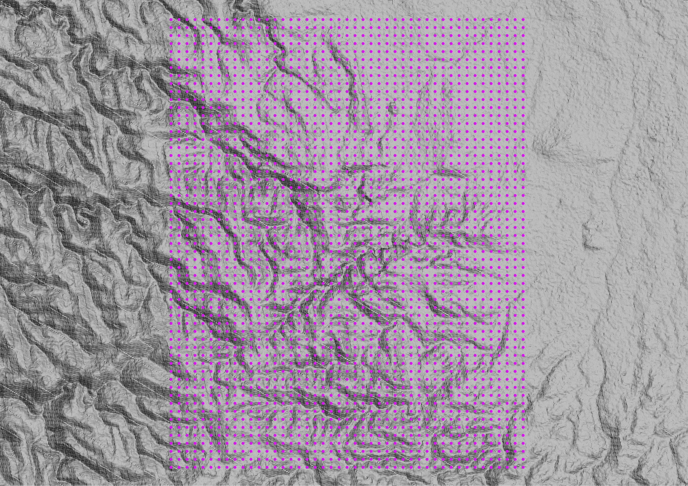
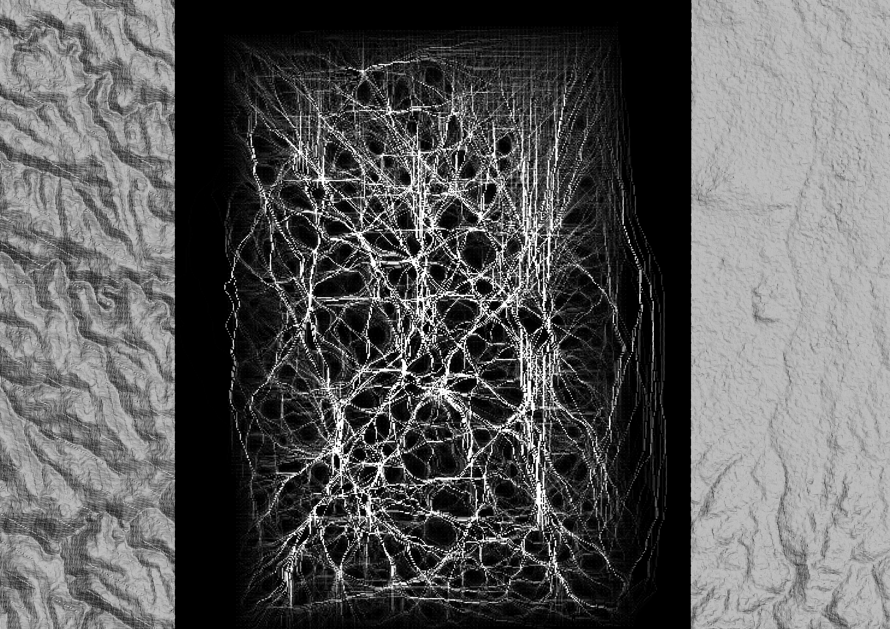
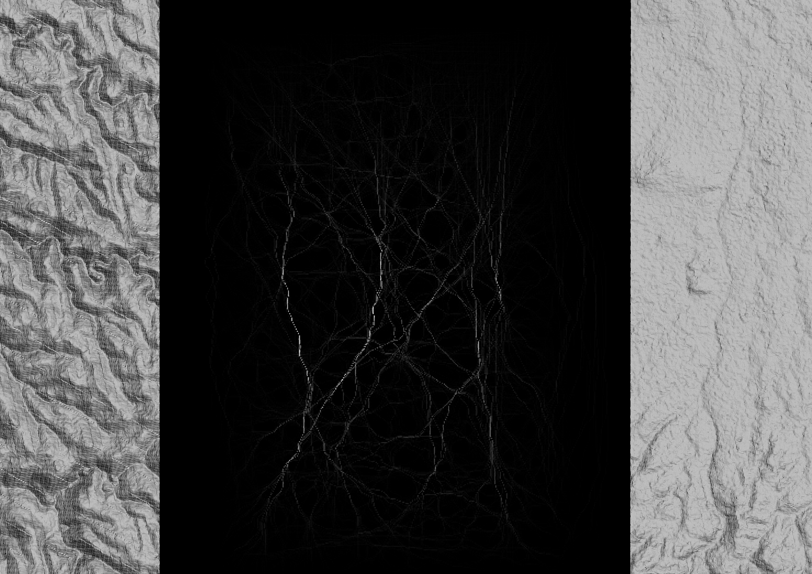
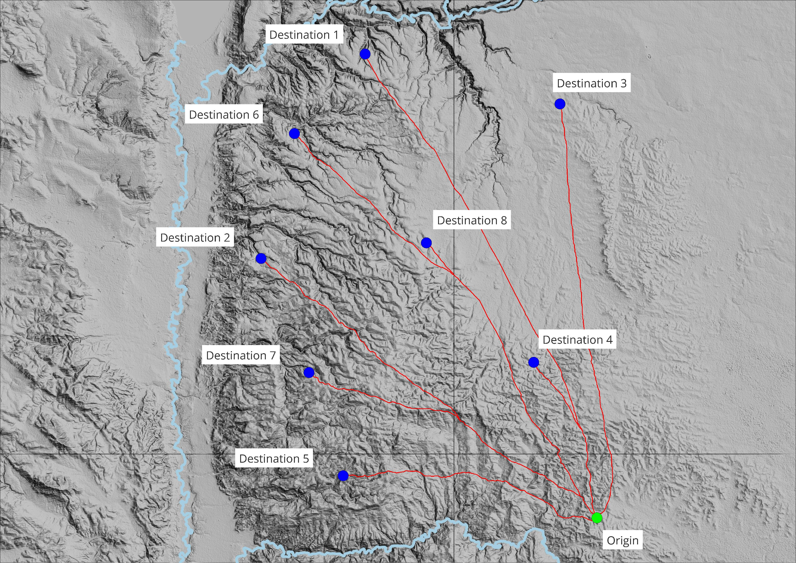
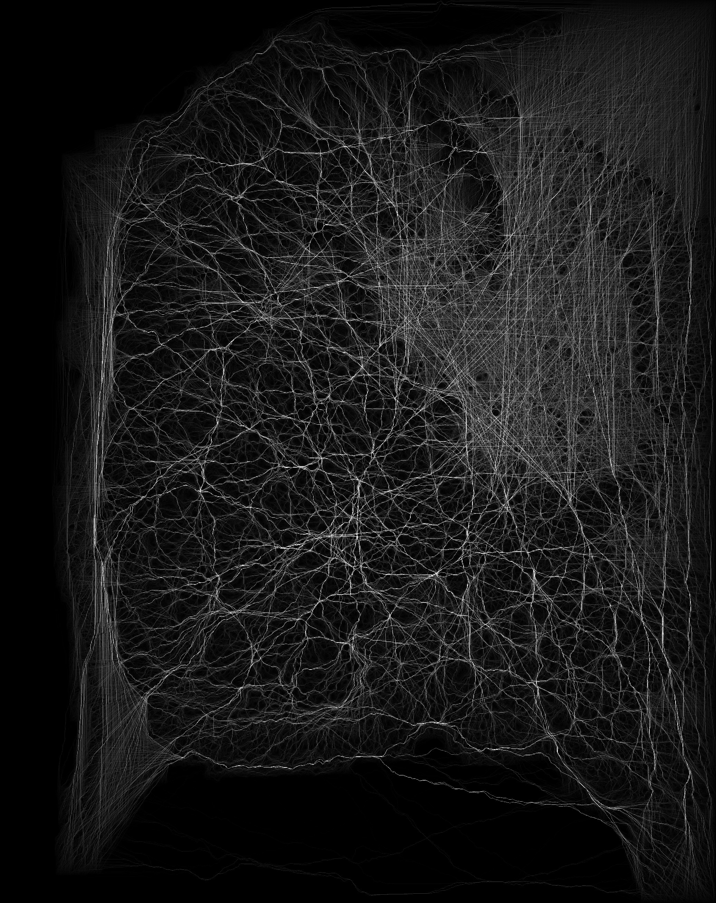
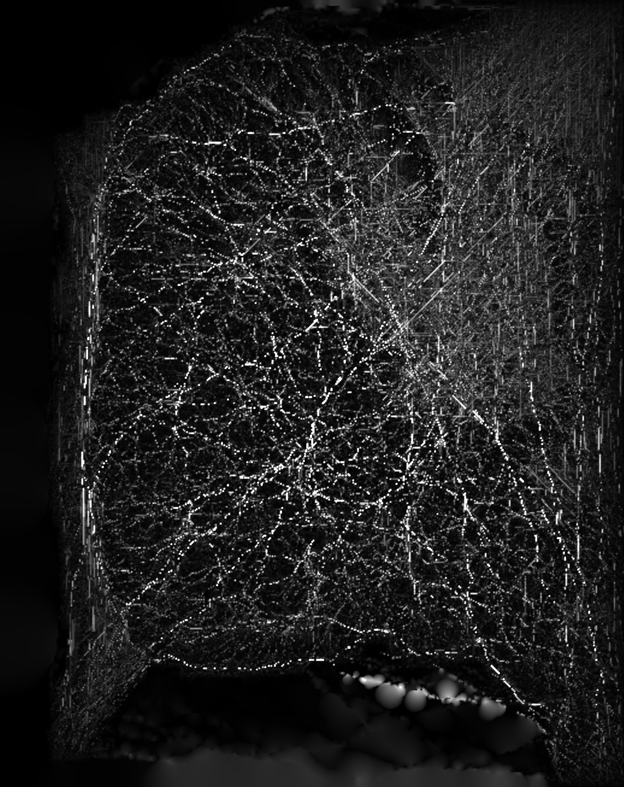

# Trajecta

> [!IMPORTANT]
> To install the latest version of Trajecta (**v1.0.1**) [download the installer](https://github.com/ArcheoHacker1501/trajecta/releases/tag/v1.0.1) and click on it once the download is done. Then follow the instructions.

**Trajecta** is a free, open-source least-cost analysis (LCA) software distributed under the GNU General Public License 3.0. It is shipped along with **Trajecta Studio**, a fully customized GUI (Graphic User Interface) specifically developed to provide a seamless and user-friendly experience to every type of user, even without prior experience. Trajecta and Trajecta Studio are primarily designed to be used by archaeologists, historians, geographers, and other researchers who need to model movement across landscapes to investigate spatial patterns in the Ancient World.

At its core, Trajecta models movement across a landscape using **FETE (From-Everywhere-To-Everywhere)** and **LCPA (Least-Cost Path Analysis)** analyses. It also refines and checks the result with **NNI (Natural Neighbour Interpolation)** and the **route comparison tool**, and tests it against real settlement patterns with the **site-corridor coherence tool**. Finally, the built-in **Viewer** offers a simple platform to visualize the results of the computations directly in the Trajecta app.

Detailed descriptions of all features implemented in Trajecta are available directly in the app in the dedicated **Guide** section. 

Importantly, Trajecta was inspired and made possible thanks to the previous work of many scholars from different fields. All the references and sources used to develop Trajecta are listed in the **References** section.

> [!IMPORTANT]
> Be patient, this software is currently under development and can contain bugs or errors! For bug reporting, problems during the installation, or to suggest improvements or additional features to be included in Trajecta, please contact me or use the in-app **report form**.

# Processing: FETE — From-Everywhere-To-Everywhere

Trajecta provides two complementary workflows for modeling movement across terrain: FETE, described here, and LCPA on the next page. Both use anisotropic cost functions (e.g. Modified Tobler's Hiking Function, see Algorithm parameters) and support cost surface modifiers (e.g. waterbodies, terrain indexes).

From-Everywhere-To-Everywhere (FETE) is a GIS-based method initially conceptualized by White and Barber (2012). FETE allows to model probable movement corridors across a landscape without requiring predetermined origin and destination points as, instead, in Least-Cost Path Analysis (see next section). In this way, instead of calculating single paths between pre-selected points, FETE allows to model the general mobility characterizing a region. This is done by using a grid containing hundreds, thousands or even hundred of thousands regularly or randomly scattered points. The FETE algorithm implemented by Trajecta then calculates all the least-cost paths connecting every point to every other point of the grid. Based on all the LCPs calculated, overlap analysis is then computed and a density raster is created, with the same resolution as the input DEM. Each cell of the density raster contains a number. This number is the arithmetical sum of all the LCPs that cross that specific cell. The most crossed cells (i.e. those with highest values) represent the busiest and most travelled routes. Different color gradients can be used to display most probable paths among all calculated LCPs corridors. 

To compute all these LCPs, DEM or other elevation based data can be used to calculate slope which can then be transformed using cost functions (e.g. Tobler's Hiking Function). Additional costs can be added as for waterbodies or different types of terrain via raster or vector inputs.

The density raster generated can then be used in different ways and further analyzed using the different tools implemented in Trajecta Studio. For example, it can be compared to known routes or settlements in order to assess possible relationships between mobility across a region and settlement patterns.

<table border="0" cellspacing="10" width="100%">
<tr>
<td align="center"></td>
<td align="center"></td>
</tr>
<tr>
<td align="center"><i>Example of regular point grid and SRTM 30m DEM used as input for FETE computation.</i></td>
<td align="center"><i>Unfiltered FETE raster resulting from computation with Trajecta.</i></td>
</tr>
</table>

<table border="0" cellspacing="10" width="100%">
<tr><td align="center"></td></tr>
<tr><td align="center"><i>Filtered FETE raster using only top 20% results.</i></td></tr>
</table>

# Processing: LCPA — Least-Cost Path Analysis

For a detailed introduction to Least-Cost Path Analysis (LCPA), see White (2015). LCPA is a spatial analysis method, typically implemented in GIS environments, that identifies the minimum cumulative-cost route between two points across a cost surface. Each cell of the raster grid represents the cost of traversing it – expressed in terms of physical effort, time, energy expenditure, or resistance to movement – calculated as a function of variables such as slope, land cover, hydrography, or other environmental and cultural factors relevant to the study context.

Algorithmically, the raster surface is treated as a weighted graph (cells as nodes, adjacencies as edges), and the problem is solved with shortest-path algorithms such as Dijkstra's or A* (A-star), which compute both the accumulated cost surface from the source and the optimal path to one or more destinations. A key distinction is between isotropic cost (equal in every direction) and anisotropic cost (direction-dependent, as with slope varying between ascent and descent – Tobler's Hiking Function being the classic example for pedestrian movement).

In archaeology, LCPA is widely used to reconstruct probable movement corridors, ancient route networks, or trade paths from digital elevation models, on the assumption that human movement tends to minimize effort. It should nonetheless be used cautiously when investigating ancient routes: LCPA inherently introduces a strong selection bias as it necessarily needs the user to select at least two points (one origin and at least one destination) to be connected. Importantly, the two points might have never been actually connected in ancient times. Consequently, this selection bias must always be taken into account and additional proofing of the results should be always provided.

To compute LCPs in Trajecta, DEM or other elevation based data can be used to calculate slope which can then be transformed using different cost functions (e.g. Modified Tobler's Hiking Function, Irmischer and Clarke 2017, Herzog 2013). Additional costs can be added as for waterbodies or terrain indexes using raster or vector input layers.

<table border="0" cellspacing="10" width="100%">
<tr><td align="center"></td></tr>
<tr><td align="center"><i>Least-Cost Paths from single origin to multiple destinations calculated using
Trajecta and SRTM 30m DEM.</i></td></tr>
</table>

# Post-processing: NNI — Natural Neighbour Interpolation

The **Post-processing** page turns a FETE density raster into a smooth,
continuous surface using **discrete Sibson (natural neighbour) interpolation
(Sibson 1981; Park et al. 2006)**. 
Cells at or above the **sample threshold** act as sample points; every other
cell receives the average of the samples whose influence area it would claim.
Sample values are preserved exactly. The optional **max search radius** caps
how far the interpolation reaches into empty areas (beyond it, cells take the
value of their nearest sample), which keeps large rasters fast. After a
successful FETE run the density raster is filled in automatically, allowing for direct post-processing.

<table border="0" cellspacing="10" width="100%">
<tr>
<td align="center"></td>
<td align="center"></td>
</tr>
<tr>
<td align="center"><i>FETE density raster generated with Trajecta.</i></td>
<td align="center"><i>The same FETE density raster after NNI.</i></td>
</tr>
</table>

# Post-processing: comparison against a known route

The route comparison tool measures a route computed through FETE or LCPA against a route that is actually known (e.g. a known Roman road, a drover's track or a surveyed path). This is the step that turns a least-cost path from an illustration into a claim that can be wrong; without it a model can only ever agree with itself.

The tool generates a short report. The report gives, in both directions, the median, the 90th percentile and the maximum distance from one line to the other, and the share of each line that runs within the tolerance of the other. A distribution rather than a single number, because a route can follow the real one closely for 9 km and then take the wrong side of a hill for 1 km — and an average hides exactly that. Both directions are needed too: a short computed path lying on top of a long known one is close in one direction and far in the other. The worst disagreement anywhere, the maximum of the two, is the Hausdorff distance (Hausdorff 1914).

# Post-processing: site-corridor coherence analysis

The third tool asks the question the FETE was computed for: **do the sites sit on the
movement the surface predicts?** It takes the FETE surface and a **point layer of
sites**, and gives every site a score, the sample a verdict, and — this is the part that
makes two periods comparable — a statement of how much of that could have happened by
chance.

In simple terms, the site-corridor coherence tool aims at answering four main questions:

1. **Are any of the sites near a corridor at all?** If almost none is, everything below is
noise and you can stop your analysis here.
2. **How far are the sites from the corridors?** The first quantity: near is not a yes or no,
it is a distance. Two sites (e.g. site A and site B) can be equally considered 'near' to a
corridor if this is within a distance of — for example — 500 m. Nonetheless, this same corridor
might be 400 m from site A and only 40 m from site B. Clearly, this is a significant difference
that would be impossible to detect with a binary 'near/far' classification.
3. **How much corridor is around the sites?** Two sites (e.g. site A and site B) at the same
distance from a route are not in the same place if one has a single thread nearby and the other a
whole braid. Site A might be near a single, thin corridor while Site B might be near several,
larger corridors. This makes a big difference when assessing site-corridor coherence. It is
important to know not only how many corridors are near a single site, but also how big these
corridors are.
4. **How busy is the ground around the sites?** Not how much corridor, but how heavily
travelled it is. You can have sites near several or even a lot of corridors, but these corridors
might be only limitedly travelled. On the contrary, you can have a site with just a corridor in
its vicinity, but that corridor might be extremely busy.

# Credits

Trajecta uses several third-party software packages to work.

## GDAL

The Trajecta engine relies on the [**GDAL**](https://gdal.org/en/stable/) geospatial libraries. They are
installed together with Trajecta and sit next to the engine, so there is nothing
to install separately and no PATH to configure. The status at the bottom of the
sidebar should read **GDAL ready** from the first launch.

Trajecta looks beside its own engine before it looks anywhere else, which is
what makes this dependable: an installed copy always uses the libraries it
shipped with, and cannot be disturbed by any other GDAL on the machine — a QGIS
or OSGeo4W install included, whether it is updated, moved or removed.

If the status is not green, the installation is incomplete or the program has
been moved by hand rather than installed. Reinstalling is the proper remedy; as
a stopgap, **Locate GDAL folder** in the sidebar accepts any folder holding
`gdal*.dll`.

## Qt6

[**Qt6**](https://www.qt.io/product/qt6/qml-book/ch17-qtcpp-qtcpp) is the cross-platform application framework Trajecta Studio's
entire graphical interface is built with — every window, button and widget in
the program, including this Guide, is drawn by it. It is a separate, independent
project from GDAL: Qt draws and runs the interface, GDAL reads and writes the
geospatial data behind it. Trajecta bundles the Qt libraries it needs, the same
way it bundles GDAL, so nothing has to be installed separately for either.

# References

Baddeley, A., Rubak, E., & Turner, R. (2015). *Spatial Point Patterns:
Methodology and Applications with R*. Chapman & Hall/CRC.

Besag, J., & Diggle, P. J. (1977). Simple Monte Carlo tests for spatial
pattern. *Journal of the Royal Statistical Society: Series C (Applied
Statistics)*, 26(3), 327–333.
[doi:10.2307/2346974](https://doi.org/10.2307/2346974)

Bresenham, J. E. (1965). Algorithm for computer control of a digital plotter.
*IBM Systems Journal*, 4(1), 25–30.
[doi:10.1147/sj.41.0025](https://doi.org/10.1147/sj.41.0025)

Campbell, M. J., Dennison, P. E., Butler, B. W., & Page, W. G. (2019).
Using crowdsourced fitness tracker data to model the relationship between slope
and travel rates. *Applied Geography*, 106, 93–107.
[doi:10.1016/j.apgeog.2019.03.008](https://doi.org/10.1016/j.apgeog.2019.03.008)

Dijkstra, E. W. (1959). A note on two problems in connexion with graphs.
*Numerische Mathematik*, 1, 269–271.
[doi:10.1007/BF01386390](https://doi.org/10.1007/BF01386390)

Felzenszwalb, P. F., & Huttenlocher, D. P. (2012). Distance transforms of
sampled functions. *Theory of Computing*, 8(19), 415–428.
[doi:10.4086/toc.2012.v008a019](https://doi.org/10.4086/toc.2012.v008a019)

Hausdorff, F. (1914). *Grundzüge der Mengenlehre*. Veit & Comp.

Herzog, I. (2013). The potential and limits of Optimal Path Analysis. In
A. Bevan & M. Lake (eds.), *Computational Approaches to Archaeological
Spaces* (pp. 179–211). Left Coast Press.

Herzog, I. (2014). A review of case studies in archaeological least-cost
analysis. *Archeologia e Calcolatori*, 25, 223–239.

Hope, A. C. A. (1968). A simplified Monte Carlo significance test procedure.
*Journal of the Royal Statistical Society: Series B (Methodological)*,
30(3), 582–598.
[doi:10.1111/j.2517-6161.1968.tb00759.x](https://doi.org/10.1111/j.2517-6161.1968.tb00759.x)

Irmischer, I. J., & Clarke, K. C. (2017). Measuring and modeling the
speed of human navigation. *Cartography and Geographic Information Science*,
45(2), 177–186.
[doi:10.1080/15230406.2017.1292150](https://doi.org/10.1080/15230406.2017.1292150)

Liang, Y.-D., & Barsky, B. A. (1984). A new concept and method for line
clipping. *ACM Transactions on Graphics*, 3(1), 1–22.
[doi:10.1145/357332.357333](https://doi.org/10.1145/357332.357333)

Lotwick, H. W., & Silverman, B. W. (1982). Methods for analysing spatial
processes of several types of points. *Journal of the Royal Statistical
Society: Series B (Methodological)*, 44(3), 406–413.
[doi:10.1111/j.2517-6161.1982.tb01221.x](https://doi.org/10.1111/j.2517-6161.1982.tb01221.x)

Márquez-Pérez, J., Vallejo-Villalta, I., &
Álvarez-Francoso, J. I. (2017). Estimated travel time for walking trails
in natural areas. *Geografisk Tidsskrift–Danish Journal of Geography*,
117(1), 53–62.
[doi:10.1080/00167223.2017.1316212](https://doi.org/10.1080/00167223.2017.1316212)

Minetti, A. E., Moia, C., Roi, G. S., Susta, D., & Ferretti, G. (2002).
Energy cost of walking and running at extreme uphill and downhill slopes.
*Journal of Applied Physiology*, 93(3), 1039–1046.
[doi:10.1152/japplphysiol.01177.2001](https://doi.org/10.1152/japplphysiol.01177.2001)

Otsu, N. (1979). A threshold selection method from gray-level histograms.
*IEEE Transactions on Systems, Man, and Cybernetics*, 9(1), 62–66.
[doi:10.1109/TSMC.1979.4310076](https://doi.org/10.1109/TSMC.1979.4310076)

Park, S. W., Linsen, L., Kreylos, O., Owens, J. D., & Hamann, B. (2006).
Discrete Sibson interpolation. *IEEE Transactions on Visualization and
Computer Graphics*, 12(2), 243–253.
[doi:10.1109/TVCG.2006.27](https://doi.org/10.1109/TVCG.2006.27)

Sibson, R. (1981). A brief description of natural neighbour interpolation. In
V. Barnett (ed.), *Interpreting Multivariate Data* (pp. 21–36). Wiley.

Tobler, W. (1993). *Three presentations on geographical analysis and
modeling*. National Center for Geographic Information and Analysis,
Technical Report 93-1.

White, D. A. (2015). The Basics of Least Cost Analysis for Archaeological
Applications. *Advances in Archaeological Practice*, 3(4), 407–414.
[doi:10.7183/2326-3768.3.4.407](https://doi.org/10.7183/2326-3768.3.4.407)

White, D. A., & Barber, S. B. (2012). Geospatial modeling of pedestrian
transportation networks: A case study from precolumbian Oaxaca, Mexico.
*Journal of Archaeological Science*, 39(8), 2684–2696.
[doi:10.1016/j.jas.2012.04.017](https://doi.org/10.1016/j.jas.2012.04.017)
